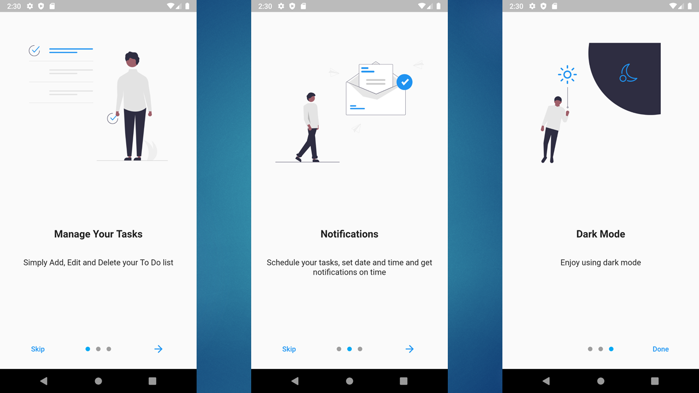
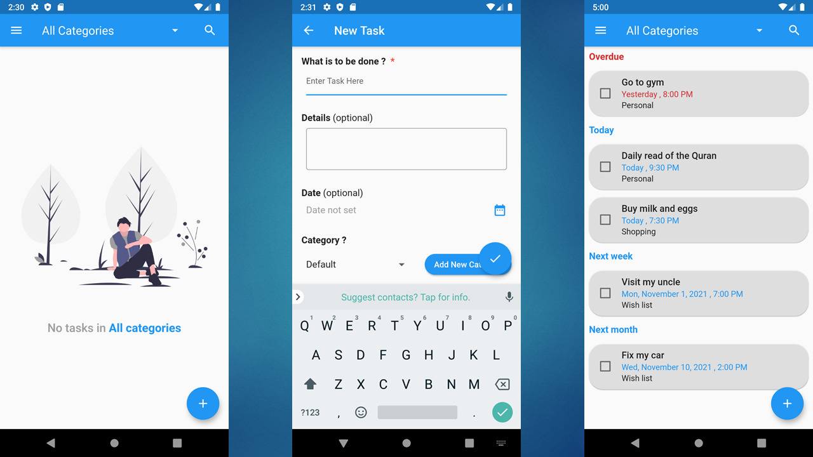
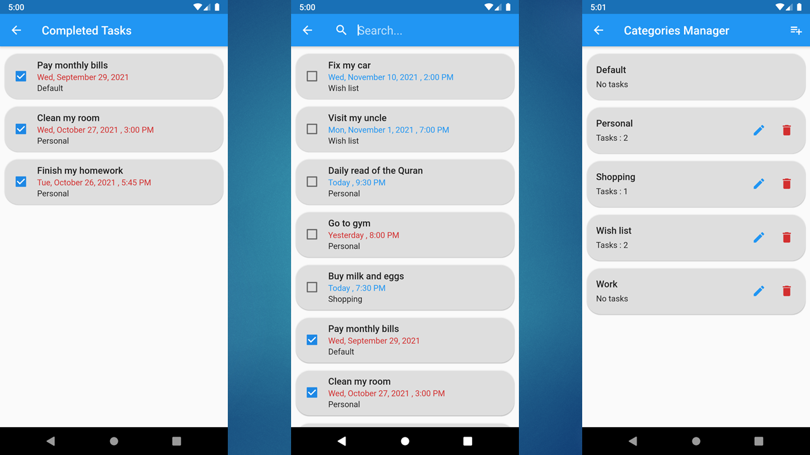
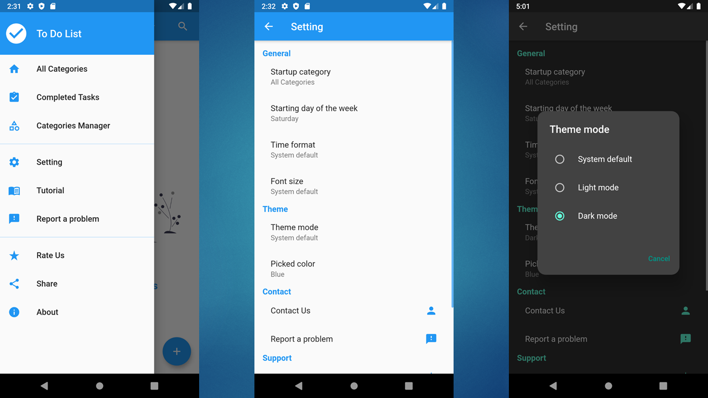
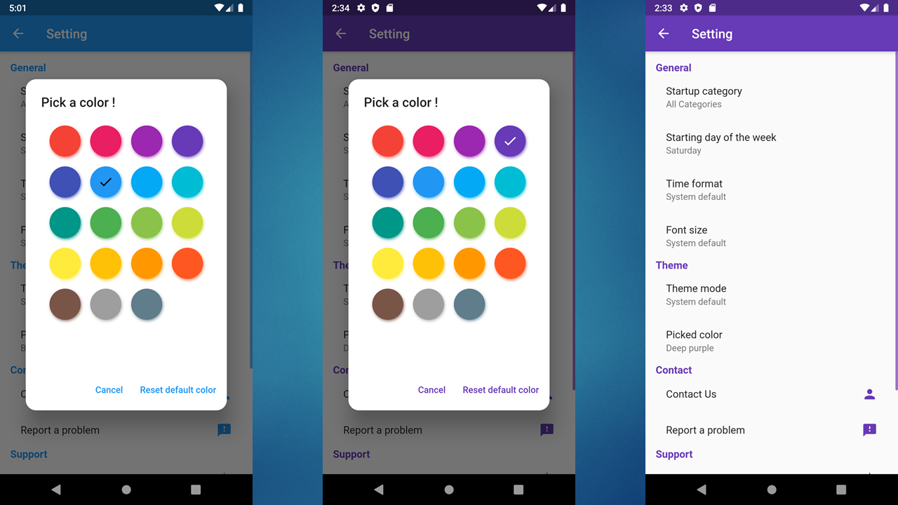

<!-- vertical space &nbsp; -->

# &ensp;TO Do List

## Looking forward to staying focused and freeing up your mind with beautiful user interface and great user experience? you are in the right place, To Do List provides a smart task manager for your life to-do lists. Without any ads and with a great support team, that is the best choice!

## ⚡&ensp;Key features

*  No Ads at all.

* Simple interface, easy to use.

* Working on offline mode, no need for the internet connection.

* Get notifications on time.

* Supporting both light and dark mode.

* Choose your favorite color from the color palette.

* Share your tasks with other apps.

* Add, Edit, Delete and Mark tasks as finished.

* Place your tasks into categories.

* Search for your tasks.

* Great support and more!
---

## ☎️&ensp;abdo.sw.eng@gmail.com

## ✌&ensp;Preview

&ensp;

